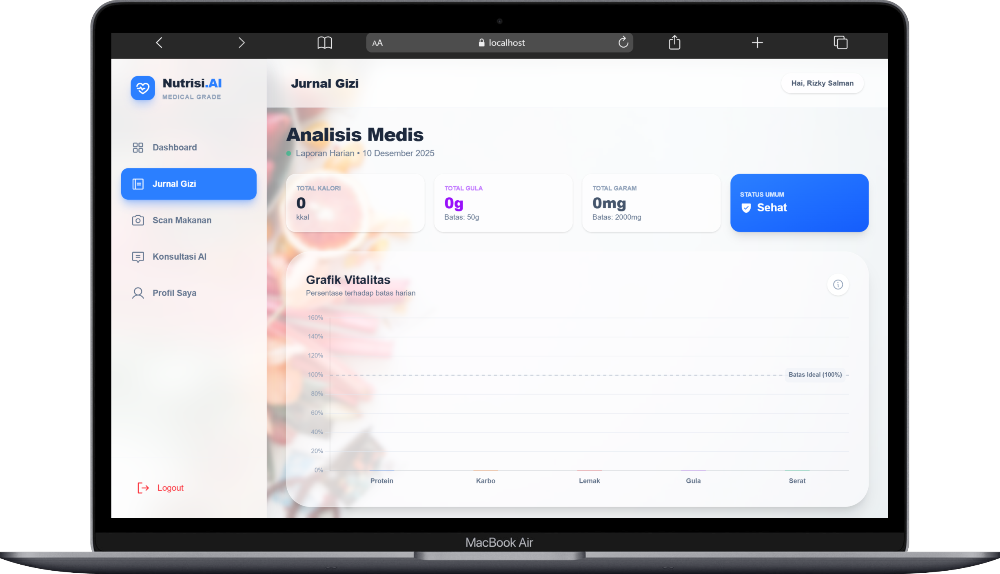

# 🥗 Nutrisi.AI - Medical Grade Nutrition Assistant



<div align="center">


</div>

---

## 📖 Tentang Projek

**Nutrisi.AI** adalah aplikasi kesehatan cerdas yang dirancang untuk memantau asupan nutrisi secara **Personalized** dan **Medical Grade**.

Tidak seperti aplikasi pencatat kalori biasa, Nutrisi.AI mengintegrasikan **Kecerdasan Buatan (AI)** untuk mendeteksi risiko kesehatan (seperti Diabetes, Hipertensi, Kolesterol) berdasarkan makanan yang dikonsumsi pengguna secara *real-time*. Aplikasi ini juga menghitung kebutuhan kalori harian menggunakan standar medis (Rumus Mifflin-St Jeor) yang disesuaikan dengan data fisik pengguna.

### 🌟 Fitur Unggulan

* **🤖 AI Food Scanner:** Analisis kandungan nutrisi hanya dengan memfoto makanan.
* **🛡️ Medical Guard System:** Peringatan dini untuk makanan berisiko.
* **📊 Dynamic Dashboard:** Visualisasi nutrisi lengkap.
* **💧 Hydration Tracker:** Animasi hidrasi harian.
* **💬 Konsultasi Dokter AI:** Chatbot dengan konteks medis penuh.
* **📈 Jurnal Gizi:** Statistik harian lengkap.

---

## 🛠️ Teknologi yang Digunakan

### Frontend

* React.js (Vite)
* Tailwind CSS
* Chart.js
* Phosphor Icons
* Axios & Context API

### Backend

* Node.js & Express
* Sequelize ORM
* Gemini AI (Gemini 1.5 Flash)
* Multer
* JWT & Bcrypt

### Database

* MySQL

---

## 📸 Tampilan Aplikasi

| Dashboard                                                   | Jurnal                                                   |
| ----------------------------------------------------------- | -------------------------------------------------------- |
|  |  |

| Scanner                                                   | AI Chat                                                   |
| --------------------------------------------------------- | --------------------------------------------------------- |
|  |  |

---

## 🚀 Cara Menjalankan

### 1. Prasyarat

* Node.js v16+
* MySQL Server

### 2. Clone Repository

```bash
git clone https://github.com/username/nutrisi-ai.git
cd nutrisi-ai
```

### 3. Setup Backend

```bash
cd nutrisiAIbe
npm install
```

Buat file `.env`:

```
PORT=5000
DB_HOST=localhost
DB_USER=root
DB_PASS=
DB_NAME=nutrisi_ai_db
JWT_SECRET=rahasia_negara_api_123
GEMINI_API_KEY=API_KEY_ANDA
```

Jalankan server:

```bash
nodemon server.js
```

### 4. Setup Frontend

```bash
cd nutrisiAIfe
npm install
npm run dev
```

### 5. Jalankan Aplikasi

Buka: **[http://localhost:5173](http://localhost:5173)**

---

## 🔬 Scientific Basis

* **Mifflin-St Jeor Equation**
* **WHO Guidelines** untuk batas gula & garam
* **AMDR** untuk distribusi makronutrien

---

## 🤝 Kontribusi

* Fork repo
* Buat branch
* Commit perubahan
* Push & Pull Request

© 2025 Nutrisi.AI. All Rights Reserved.
